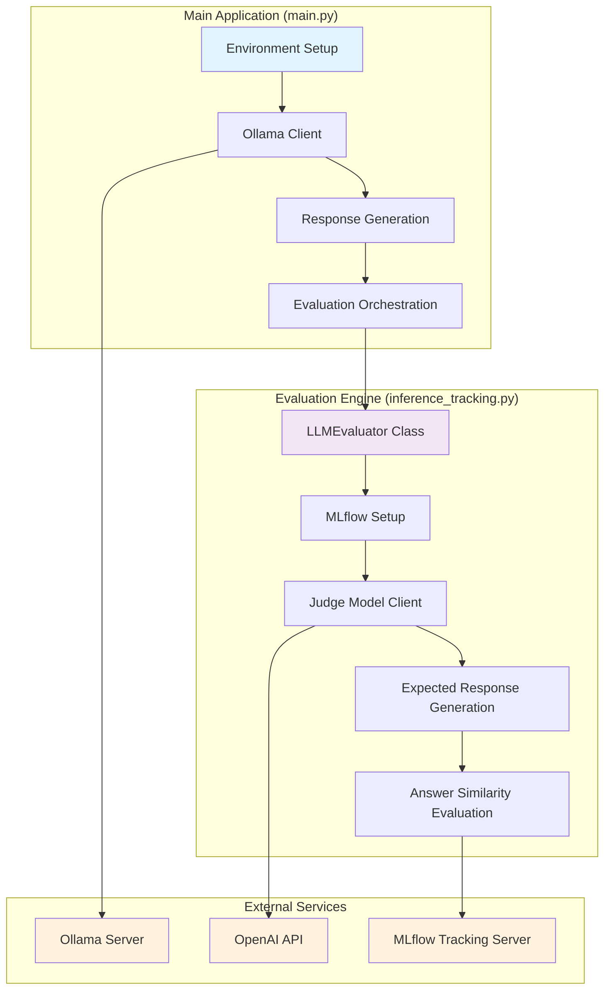
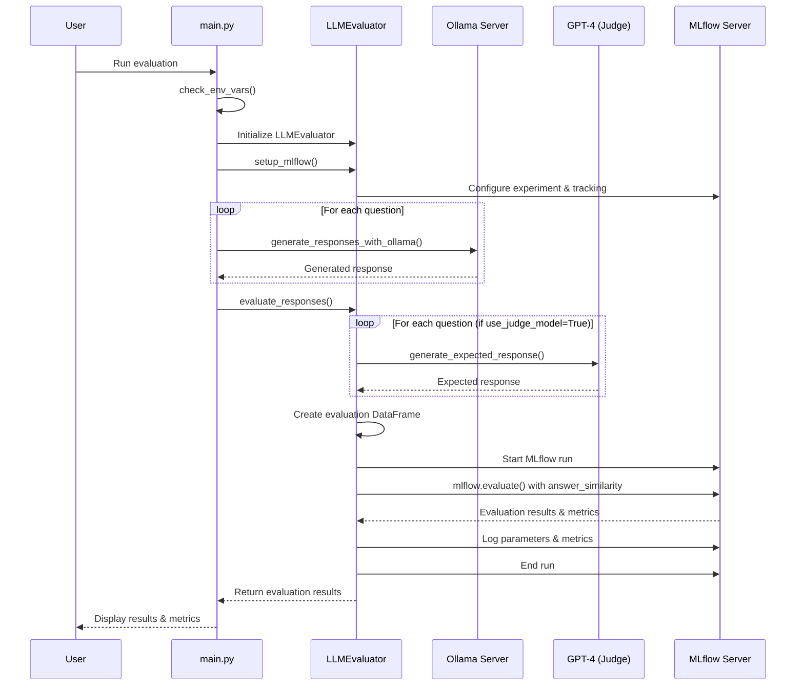

# LLM Evaluation Framework with MLflow

A comprehensive framework for evaluating Large Language Model (LLM) responses using MLflow tracking and answer similarity metrics. This system compares responses from local models (like Ollama) against reference responses generated by a judge model (GPT-4).

## 🏗️ Architecture Overview

This framework consists of two main components that work together to provide automated LLM evaluation:



## 📋 Components Documentation

### 1. Main Application (`main.py`)

The main application handles the orchestration of the evaluation process and manages the interaction with the Ollama model.

#### Key Functions:

- **`check_env_vars()`**: Validates all required environment variables
- **`chat_with_ollama(messages, client)`**: Handles individual chat requests to Ollama
- **`generate_responses_with_ollama(questions)`**: Generates responses for multiple questions
- **`main()`**: Main execution function that orchestrates the entire evaluation process

#### Responsibilities:
- Environment validation and setup
- Ollama client configuration and management
- Question batch processing
- Response generation using local LLM
- Evaluation result presentation

### 2. Evaluation Engine (`inference_tracking.py`)

The evaluation engine contains the core evaluation logic and manages the judge model for generating reference responses.

#### LLMEvaluator Class:

```python
class LLMEvaluator:
    def __init__(openai_api_key, openai_model="gpt-4", ...)
    def setup_mlflow(tracking_uri, experiment_name, ...)
    def generate_expected_response_with_judge_model(question)
    def generate_expected_responses(questions)
    def evaluate_responses(questions, generated_responses, ...)
```

#### Key Features:
- **Judge Model Integration**: Uses GPT-4 as a reference model to generate expected responses
- **MLflow Integration**: Comprehensive experiment tracking and metrics logging
- **Answer Similarity Evaluation**: Uses MLflow's answer similarity metric for evaluation
- **Flexible Configuration**: Customizable temperature, token limits, and model selection

## 🔄 Sequence Diagram

The following diagram shows the complete evaluation flow:



## 🚀 Installation & Setup

### Prerequisites

```bash
pip install mlflow openai pandas httpx python-dotenv
```

### Environment Variables

Create a `.env` file with the following variables:

```env
# OpenAI Configuration
OPENAI_API_KEY=your_openai_api_key_here
OPENAI_MODEL=gpt-4

# Ollama Configuration  
OLLAMA_BASE_URL=http://localhost:11434/v1
OLLAMA_MODEL=llama3.1:8b
OPENAPI_KEY=ollama  # Can be any value for Ollama

# MLflow Configuration
MLFLOW_TRACKING_URI=http://localhost:5000
MLFLOW_EXPERIMENT_NAME=llm_evaluation
MLFLOW_ACTIVE_MODEL_NAME=llama318b_model
```

## 💻 Usage

### Basic Usage

```python
python main.py
```

### Custom Usage

```python
from inference_tracking import LLMEvaluator

# Initialize evaluator
evaluator = LLMEvaluator(
    openai_api_key="your_key",
    openai_model="gpt-4",
    teacher_model_temperature=0.7,
    teacher_model_max_tokens=1500
)

# Setup MLflow
evaluator.setup_mlflow(
    tracking_uri="http://localhost:5000",
    experiment_name="my_experiment"
)

# Evaluate responses
results = evaluator.evaluate_responses(
    questions=["Your questions here"],
    generated_responses=["Model responses here"],
    use_judge_model=True
)
```

## 📊 Evaluation Metrics

The framework uses MLflow's answer similarity metric, which:

- **Measures semantic similarity** between generated and expected responses
- **Uses GPT-4 as judge** for nuanced evaluation beyond simple text matching
- **Returns scores** typically between 0-1 or 1-5 depending on configuration
- **Provides detailed evaluation tables** with per-question breakdowns

### Sample Output
EVALUATION RESULTS
==================================================
{
  "toxicity/v1/mean": 0.00048775022150948644,
  "toxicity/v1/variance": 5.981807220089917e-8,
  "toxicity/v1/p90": 0.000679128069896251,
  "toxicity/v1/ratio": 0,
  "flesch_kincaid_grade_level/v1/mean": 11.648765204520535,
  "flesch_kincaid_grade_level/v1/variance": 2.835691986616707,
  "flesch_kincaid_grade_level/v1/p90": 13.276736294240113,
  "ari_grade_level/v1/mean": 14.132587079661844,
  "ari_grade_level/v1/variance": 4.106832676967216,
  "ari_grade_level/v1/p90": 16.172256118436273,
  "answer_similarity/v1/mean": 3.6666666666666665,
  "answer_similarity/v1/variance": 0.22222222222222224,
  "answer_similarity/v1/p90": 4
}

## 🎯 Key Features

- **🔄 Automated Evaluation**: End-to-end evaluation pipeline from question to metrics
- **📈 MLflow Integration**: Complete experiment tracking and reproducibility  
- **🤖 Judge Model**: GPT-4 as reference for generating expected responses
- **🎛️ Configurable**: Flexible model parameters and evaluation settings
- **📝 Comprehensive Logging**: Detailed logging for debugging and monitoring
- **🔧 Extensible**: Easy to add new metrics and evaluation methods

## 🔧 Configuration Options

### LLMEvaluator Parameters

| Parameter | Type | Default | Description |
|-----------|------|---------|-------------|
| `openai_api_key` | str | Required | OpenAI API key for judge model |
| `openai_model` | str | "gpt-4" | OpenAI model to use as judge |
| `teacher_model_temperature` | float | 0.7 | Temperature for judge model responses |
| `teacher_model_max_tokens` | int | 1500 | Maximum tokens for judge responses |

### Environment Variables

| Variable | Required | Description |
|----------|----------|-------------|
| `OPENAI_API_KEY` | ✅ | OpenAI API key for judge model |
| `OLLAMA_BASE_URL` | ✅ | Ollama server endpoint |
| `OLLAMA_MODEL` | ✅ | Ollama model name |
| `MLFLOW_TRACKING_URI` | ✅ | MLflow tracking server URI |
| `MLFLOW_EXPERIMENT_NAME` | ✅ | MLflow experiment name |
| `OPENAI_MODEL` | ❌ | OpenAI model name (default: gpt-4) |

## 🐛 Troubleshooting

### Common Issues

1. **Import Error**: Ensure file names use underscores (`inference_tracking.py`) not hyphens
2. **MLflow Connection**: Verify MLflow server is running and accessible
3. **Ollama Connection**: Check Ollama server status and model availability
4. **OpenAI API**: Verify API key has sufficient credits and correct permissions

### Debug Mode

Enable detailed logging by modifying the logging configuration:

```python
logging.basicConfig(level=logging.DEBUG)
```


## 🤝 Contributing

Feel free to contribute by:
- Adding new evaluation metrics
- Implementing async/parallel processing
- Enhancing error handling
- Adding support for other LLM providers

## 📄 License

This project is open source and available under the MIT License.